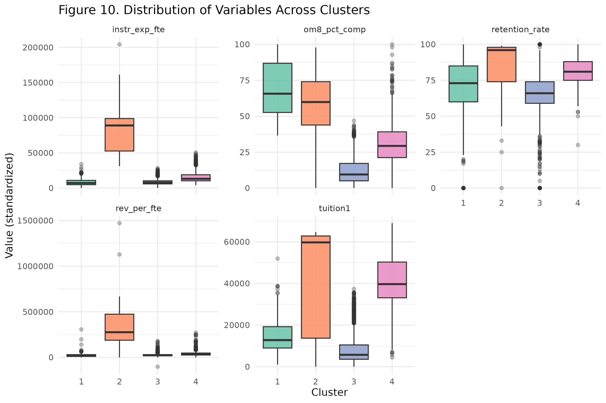

## Introduction: Motivation {.smaller}

**Motivation:**  
Traditional labels (public/private, Carnegie type) often fail to capture how
institutions actually operate when you examine resources and outcomes.

::: incremental
- Institutions with different missions can look very similar numerically.
- Designations like *elite* or *regional* do not always reflect actual
  performance.
- Quantitative grouping provides a more objective baseline for comparison.
:::

## Introduction: Research Question {.smaller}

::: incremental
- **Research question:**  
  **How do U.S. colleges naturally cluster when we focus strictly on
  quantitative metrics of financial resources and student outcomes per
  student?**

- **Why this matters:**
  - produces data-driven peer groups grounded in operating behavior  
  - clarifies differences in resource intensity and student success  
  - supports more accurate comparisons for funding, policy, and accountability
:::

## Introduction: Analytical Approach {.smaller}

::: incremental
- integrate 2023–24 IPEDS components into a unified dataset  
- engineer per-FTE financial and outcome metrics  
- apply standardization and Winsorization to prepare features  
- assess candidate values of \(k\) using Elbow and Silhouette methods  
- fit K-Means to identify institutional groupings  
:::

## Methods: Data Sources {.smaller}

**Data inputs:** Institution-level dataset built from 2023–24 IPEDS components.

::: incremental
- Finance  
- Completions  
- Admissions & Enrollment  
- Fall Enrollment / FTE  
:::

## Methods: Feature Engineering {.smaller}

::: incremental
- revenue per FTE  
- instructional spending per FTE  
- student services spending per FTE  
- completion rates  
- tuition and net price  
- selectivity indicators (admit rate, yield)  
:::

## Methods: Preprocessing {.smaller}

::: incremental
- standardize all numeric variables (mean 0, sd 1)  
- Winsorize at 1% and 99% to limit extreme outliers  
- remove institutions with structurally missing or invalid data  
:::

## Methods: Modeling {.smaller}

::: incremental
- K-Means clustering on standardized continuous features  
- Euclidean distance as the similarity metric  
- Elbow and Silhouette both support \(k = 4\)  
- refit final model with multiple random starts for stability  
:::

## Data Exploration: Key Variation {.smaller}

**Initial patterns in the data reveal substantial institutional variation.**

::: incremental
- **Variation across institutions in:**
  - enrollment size  
  - revenue and spending per FTE  
  - completion rates and selectivity  
:::

## Data Exploration: Distributional Patterns {.smaller}

::: incremental
- **Distributional characteristics:**
  - financial variables are strongly right-skewed  
  - motivates Winsorization before clustering  

- **Early visual findings:**
  - clear bands of high-, mid-, and low-resource institutions  
  - outcomes correlate with resource levels  

- **Implication:**
  - underlying structure is present even before modeling, suggesting
    clustering will capture meaningful distinctions
:::

## Data Visualization: Variable Distributions by Cluster {.smaller}

  

## Modeling and Results: Cluster Profiles {.smaller}

**High-level cluster profiles**

::: incremental
- **Cluster 1:** high revenue & instructional spending per FTE; strong completion
  rates; generally well-resourced institutions.
- **Cluster 2:** moderate resources and outcomes; resembles regional public /
  broad-access institutions.
- **Cluster 3:** low revenue per FTE and lower completion rates; open-access
  institutions with constrained resources.
- **Cluster 4:** higher tuition and net price with mixed completion outcomes;
  many tuition-dependent private institutions.
:::

## Modeling and Results: Interpretation {.smaller}

::: incremental
- Clusters cut across sector and Carnegie classifications.
- Institutions with similar operating models cluster together
  regardless of public/private status.
- Data-driven clustering surfaces patterns that are not obvious from
  traditional labels alone.
:::

## Conclusion {.smaller}

::: incremental
- **k = 4** produces a stable, interpretable segmentation of U.S.
  institutions.
- Resource intensity plus completion outcomes shape cluster membership
  the most.
- These clusters provide clearer institutional peer groups than legacy
  labels and can support more targeted benchmarking and policy analysis.
:::

## Conclusion: Limitations & Future Work {.smaller}

::: incremental
- **Limitations:**
  - K-Means assumes roughly spherical clusters in standardized space  
  - feature selection strongly influences cluster structure  
  - results are descriptive, not causal  

- **Future Work:**
  - experiment with Gaussian Mixture Models or hierarchical clustering  
  - incorporate multi-year financial and outcome trends  
  - compare clusters by student demographics and debt outcomes  
:::

## References {.smaller}

::: {#refs}
:::
