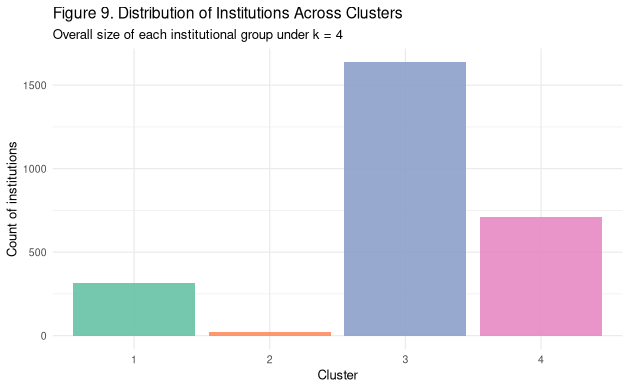

## Framing the Story {.smaller}

**Goal:** use K-Means to uncover data-driven groups of U.S. colleges and
universities based on how they actually operate.

- Traditional labels (public/private, Carnegie type, “regional,” “elite”)
  are convenient but coarse.
- Institutions with very different brands can look similar when you line up
  their resources and outcomes.
- Cluster analysis is already used in higher education research to define
  peer groups and typologies [@huberty2005cluster; @nces2023groupings;
  @elam2016classification; @tair2022peer].

The core story: what do the clusters look like when we ignore marketing
and focus strictly on money and student results?

## Introduction: Research Question {.smaller}

::: incremental
- **Research question:**  
  **How do U.S. colleges naturally cluster when we focus strictly on
  quantitative metrics of financial resources and student outcomes per
  student?**

- **Why this matters:**
  - builds peer groups grounded in operating behavior instead of labels  
  - clarifies differences in resource intensity and student success  
  - supports more accurate comparisons for funding, policy, and accountability
:::

## Introduction: Analytical Approach {.smaller}

::: incremental
- integrate 2023–24 IPEDS components into a unified institution-level dataset  
- engineer per-FTE financial and outcome metrics  
- apply standardization and Winsorization to prepare features  
- use Elbow and Silhouette methods to select \(k\)  
- fit K-Means and interpret the resulting institutional groupings  
:::

## Methods: Data Sources {.smaller}

**Data inputs:** institution-level dataset built from 2023–24 IPEDS components.

::: incremental
- Finance  
- Completions  
- Admissions & Enrollment  
- Fall Enrollment / FTE  

These components are merged on UNITID following standard data-merging
practices in higher education analytics [@kelchen2019merging].
:::

## Methods: Feature Engineering {.smaller}

::: incremental
- revenue per FTE  
- instructional spending per FTE  
- student services spending per FTE  
- completion rates for first-time, full-time cohorts  
- tuition and net price  
- selectivity indicators (admit rate, yield)  

All features are numeric and interpretable, so clusters can be described
in terms that make sense to institutional researchers and leadership.
:::

## Methods: Preprocessing {.smaller}

::: incremental
- standardize all numeric variables (mean 0, sd 1) so no single scale dominates  
- Winsorize at 1% and 99% to limit the influence of extreme outliers  
- remove institutions with structurally missing or invalid data  

This prepares a clean, comparable feature space for distance-based
clustering.
:::

## Methods: Modeling {.smaller}

::: incremental
- K-Means clustering on standardized continuous features  
- Euclidean distance as the similarity metric  
- internal validation:
  - Elbow method  
  - average Silhouette score  

K-Means is a classic, well-studied partitioning algorithm
[@lloyd1982least; @forgy1965cluster; @jain2010data], and has been used
in higher education and student analytics contexts
[@huberty2005cluster; @mohdtalib2023behavioral].
:::

## Data Exploration: Key Variation {.smaller}

**Initial patterns in the data reveal substantial institutional variation.**

::: incremental
- **Variation across institutions in:**
  - enrollment size  
  - revenue and spending per FTE  
  - completion rates and selectivity  

- prominent differences in financial intensity and outcomes even before
  modeling  
:::

## Data Exploration: Distributional Patterns {.smaller}

::: incremental
- **Distributional characteristics:**
  - financial variables are heavily right-skewed  
  - motivates Winsorization before clustering  

- **Early visual findings:**
  - clear bands of high-, mid-, and low-resource institutions  
  - outcomes correlate with resource levels  

- **Implication:**
  - underlying structure is present even before modeling, suggesting
    clustering will capture meaningful distinctions
:::

## Data Visualization: Variable Distributions by Cluster {.smaller}

  

## Modeling and Results: Choosing k {.smaller}

**Internal validation for the number of clusters.**

::: incremental
- Elbow method: clear bend at \(k = 4\) in within-cluster sum of squares.  
- Silhouette score: average silhouette peaks around \(k = 4\) and flattens
  afterwards.  
- \(k = 4\) offers a balance between model fit and interpretability.

This aligns with guidance in the clustering literature
[@jain2010data; @huberty2005cluster].
:::

## Modeling and Results: Cluster Sizes {.smaller}

  

## Modeling and Results: Cluster Profiles {.smaller}

**High-level cluster profiles**

::: incremental
- **Cluster 1:** high revenue & instructional spending per FTE; strong
  completion rates; generally well-resourced institutions.
- **Cluster 2:** moderate resources and outcomes; resembles regional public
  and broad-access institutions.
- **Cluster 3:** low revenue per FTE and lower completion rates; open-access
  institutions with constrained resources.
- **Cluster 4:** higher tuition and net price with mixed completion outcomes;
  many tuition-dependent private institutions.
:::

## Modeling and Results: Interpretation {.smaller}

::: incremental
- Clusters cut across sector and Carnegie classifications.
- Institutions with similar operating models cluster together regardless
  of public/private status.
- Some open-access institutions and low-cost providers cluster together
  despite different labels.
- Data-driven clustering surfaces patterns that are not obvious from
  traditional groupings or rankings.
:::

## Conclusion {.smaller}

::: incremental
- **k = 4** produces a stable, interpretable segmentation of U.S.
  institutions.
- Resource intensity and completion outcomes are key drivers of cluster
  membership.
- The resulting clusters provide a more nuanced view of institutional
  “peer groups” than legacy classifications alone.
:::

## Conclusion: Limitations & Future Work {.smaller}

::: incremental
- **Limitations:**
  - K-Means assumes roughly spherical clusters in standardized space  
  - cluster structure is sensitive to feature selection  
  - the analysis is descriptive and does not establish causality  

- **Future work:**
  - experiment with Gaussian Mixture Models or hierarchical clustering  
  - incorporate multi-year financial and outcome trends  
  - compare clusters by student demographics, debt outcomes, and labor market
    results  
:::

## References {.smaller}

::: {#refs}
:::
